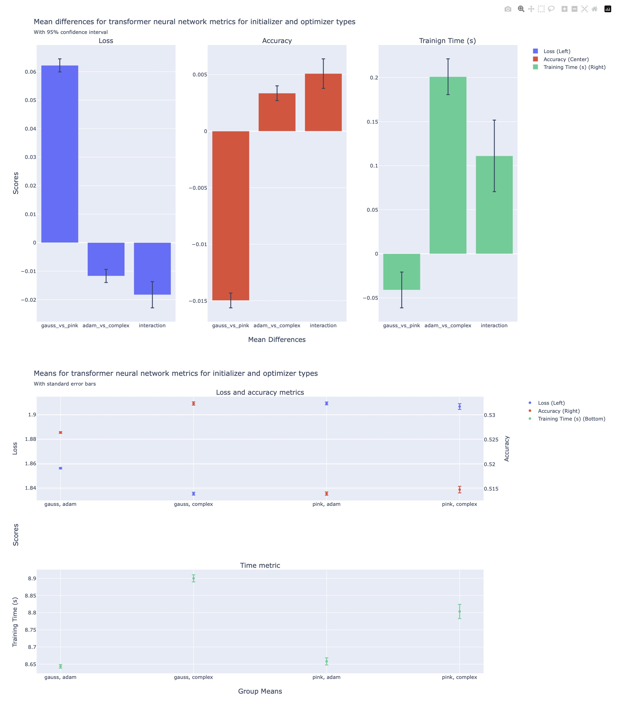

# A Project on a Performance Comparison between models with Complex Adam compared to traditional Adam initialized with Gaussian or Pink Noise

This project compares circular Gaussian and Pink Noise weight initialization by component-wise Adam and complex Adam in models that generate metrics analyzed in a 2x2 design.

This project doesn't have a literature review yet, if there is ever time to do one. The emphasis of the project is on comparing some model architectures and analyzing their differences. The investigation started with a desire to apply resampling techniques to questions about different transformer architectures. Claude was instructed to build the model, run and analysis procedures in python. Instead of providing the code the model ran a version of code on its own, then provided its conclusions instead of code. To be fair, the prompt didn't explicitly say the result was code. When re-prompted, the model provided code - nailed the architectures, fell flat on the the analysis because of its own scope creep.

Some of the run code, and the entire analysis was replaced, hand coded, with resampling methods to see what would happen when models were fit repeatedly and the summary table calculated from sampling distributions. Inconsistencies that needed some re-learning and/or creation meant slowing down from what was going to be a simple question to AI, to systematic approaches; from a typical analysis using regression, to applying bootstraping and bagging. In the process convictions became that it only *seemed* like bootstrapping and bagging were understood; a reminder about the difference between holding a conversation that can convince listeners, and revisiting or writing the manual every time something becomes unclear.


## Methods

Model code uses a PyTorch [@paszke2017automatic] implementation of the transformer model in *Attention Is All You Need* [@vaswani2017attention]. The complex variant of the Torch implementation utilizes complex Adam, complex attention constructed with rotary positional embedding (ROPE; @su2024roformer), and modRelu [@DBLP:journals/corr/TalathiV15] with a learning rate of 3e-3, d_model, heads, layers is set to 64, 2, 2.

For 4 different metrics: loss, accuracy, training time, and 1000 Small local Torch transformer neural networks were separately trained on an M2 with 24 Gb unified RAM using a python corpus with two initialization and optimization architecture choices in a fully factorial 2x2 design. Models varried by initialiation and optimizer used.

Three sum to zero orthogonal contrasts were created to test the mean differences of interest in a regression model, the slope from Gaussian initialization to Pink Noise initialization, the slope from Adam to Complex Adam, which identifies the groups mean differences due to the coding; and an interaction term to complete the factorial design. No post-hoc analyses were performed as the models coded the effects of interest directly.


### Design Matrix with Constant Term

The factor coding/design matrix, presented below, is used to generate each of the comparison columns for regression. The codes table contains the contrast codes that code for the mean differences in the regression model, and their relation to individual group means is a direct translation. The design matrix does not need to be transposed here since groups are stored as rows.

| Means | intercept | gauss vs pink | adam vs complex | interaction |
| :--- | :---: | :---: | :---: | ---: |
| (gauss, adam)    | 1 | -.5. | -.5 | -.25 |
| (gauss, complex) | 1 | -.5. |  .5 |  .25 |
| (pink, adam)     | 1 |  .5 |  -.5 |  .25 |
| (pink, complex)  | 1 |  .5 |   .5 | -.25 |

Individual estimated group means were related from the contrasts and the parameter estimates using the following relation:

$$ \hat \mu_{g} = M \cdot \hat \beta $$

A statistical model was fit to the trial metrics for loss, accuracy and training time(s). Sum to zero orthogonal contrasts were created to result in the parameter estimates being the mean difference between Adam vs Complex Adam optimizers and Gaussian vs Pink Noise weight initialization.

$$ (loss, acc, secs) = AdamVsComplex + GaussVsPink + (AdamVsComplex * GaussVsPink) $$

## Comparing the Architectures

To train models, gather loss, accuracy and training time; run the following to run n model training and evaluation sessions, storing the weights in the checkpoints folder and using a seed for reproducibility (use -1 to ignore the seed). If using around 4000 trials (N=1000 crossed across 4 groups), the process can take around 10 hours. 1000 trials for each group has 4000 runs total.

```bash
python runc.py <checkpoint subfolder and results filename> <n> <seed>
```

To analyze data and save outputs, which include an Excel file with a worksheet for each table, and an HTML file containing the figures, run:

```bash
python analysis_overall.py <source_data> <output_data>
```

The analysis may take a couple minutes. To analyze using resampling, which generates an Excel file with a worksheet for each table containing regression coefficients, and an HTML file for figure output, use the following:

```bash
python bootstrap_analysis_me.py <n rows> <n columns> <data workbook> <results workbook> <seed>
```

n rows will sample n rows from the data file. The samples will be repeated n columns. Data/results workbook are path/filenames. The time column in this case is training and evaluation time. ***The file should probably be renamed resampling_and_analysis_procedure.py***


## Results
Loss is higher for Pink Noise initialization by around 0.06 related to an accuracy for this type of transformer. Training time improved by 0.04s. Loss is less for Complex Adam than for Adam by 0.01, with a corresponding increase of accuracy by 0.3%. While reaching significance via the model, none of the differences are likely to be noticed on local models. This comparison indicates at least that Complex Adam doesn't break the model and the architecture difference can be further pursued. 



# Bibliography

