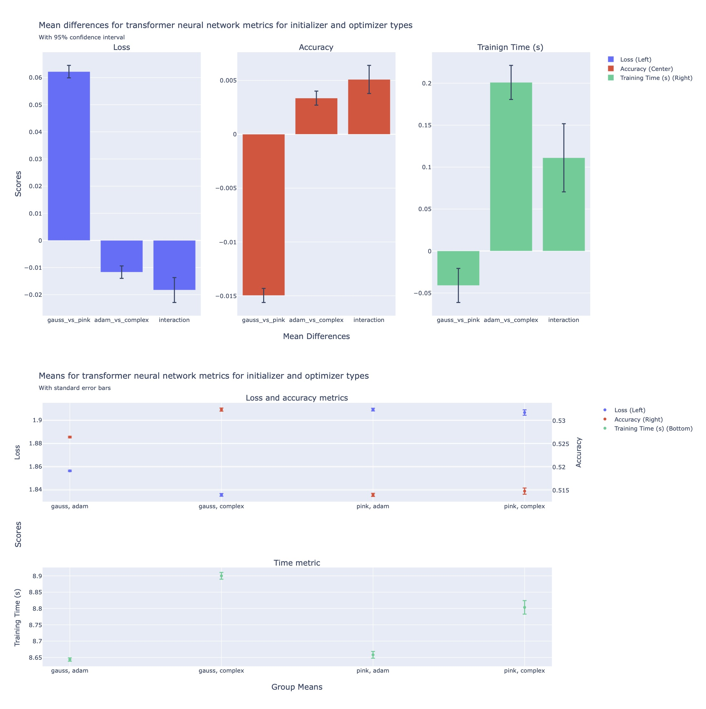

# Preliminary Performance Comparison between models with Complex adam compared to traditional adam initialized with Gaussian or Pink Noise

Gaussian initialization of transformer neural networks seems commonplace, yet there are other initialization values that can be used. Models may have less distance to cover from initialized values to functional weights with different initializers. Optimizers such as Adam, or variants, are also common, and there seems to always be interest in possible improvements. An optimizer called Complex Adam, used to train complex weights, may be beneficial compared with Adam. Pink Noise initialization was hypothesized to result in improved loss, accuracy and time over Gaussian initialization. Complex Adam, which adds phase information to weights, was tested as a preliminary construct and was hypothesized to improve loss, accuracy and time. Pink Noise initialization out performed Gaussian intialization except for time. Complex Adam outperformed Adam for Loss and Accuracy, but not time. The one advantage of Pink Noise, at about 0.04 seconds, is outweighed by the reduction in accuracy of around 1.50%. Complex Adam's advantage of approximately -0.01 Loss equated to about +0.30% in accuracy in this comparison, which is perhaps imperceptible using a local model trained on code. While only three of the hypotheses held, and were related to Complex Adam for loss and accuracy, Pink Noise initialization only for training time, they don't appear to be important difference. This comparison indicates that Complex Adam doesn't break the model and it could be interesting to note whether any Pink Noise from initialization is more evident than in Gaussian initialized weights.

## Methods

For 4 different metrics: loss, accuracy, training time, and 1000 Small local Torch transformer neural networks were separately trained on an M2 with 24 Gb unified RAM using a python corpus with two initialization and optimization architecture choices in a fully factorial 2x2 design. Models varried by initialiation and optimizer used.

Three sum to zero orthogonal contrasts were created to test the mean differences of interest in a regression model, the slope from Gaussian initialization to Pink Noise initialization, the slope from Adam to Complex Adam, which identifies the groups mean differences due to the coding; and an interaction term to complete the factorial design. No post-hoc analyses were performed as the models coded the effects of interest directly.

Individual estimated group means were related from the contrasts and the parameter estimates using the following relation:

### Design Matrix with Constant Term

The factor coding/design matrix, presented below, is used to generate each of the comparison columns for regression. The codes table contains the contrast codes that code for the mean differences in the regression model, and their relation to individual group means is a direct translation. The design matrix does not need to be transposed here since groups are stored as rows.

| Means | intercept | gauss vs pink | adam vs compelex | interaction |
| :--- | :---: | :---: | :---: | ---: |
| (gauss, adam)    | 1 | .5. |  .5 |  .25 |
| (gauss, complex) | 1 | .5. | -.5 | -.25 |
| (pink, adam)     | 1 | -.5 |  .5 | -.25 |
| (pink, complex)  | 1 | -.5 | -.5 |  .25 |

$$ \hat \mu_{g} = M \cdot \hat \beta $$

A statistical model was fit to the trial metrics for loss, accuracy and training time(s). Sum to zero orthogonal contrasts were created to result in the parameter estimates being the mean difference between Adam vs Complex Adam optimizers and Gaussian vs Pink Noise weight initialization.

$$ (loss, acc, secs) = AdamVsComplex + GaussVsPink + C(AdamVsComplex * GaussVsPink) $$

## Results

Loss is higher for Pink Noise initialization by around 0.06 related to an accuracy loss of about 1.50% though training time improved by 0.04s. Loss is **less** for Complex Adam than for Adam by 0.01, with a corresponding increase of accuracy by 0.3%. While reaching significance via the model, none of the differences are likely to be noticed on local models. This comparison indicates at least that Complex Adam doesn't break the model and the architecture difference can be further pursued. 

