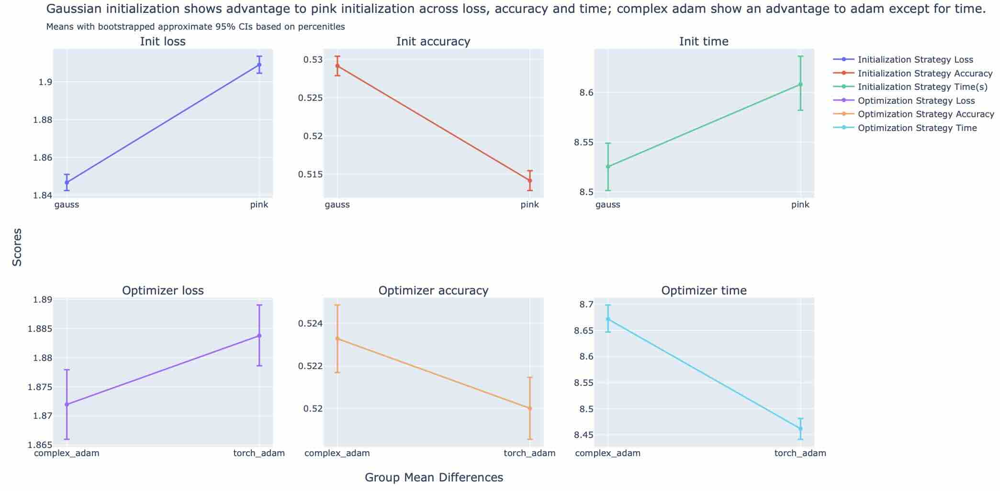
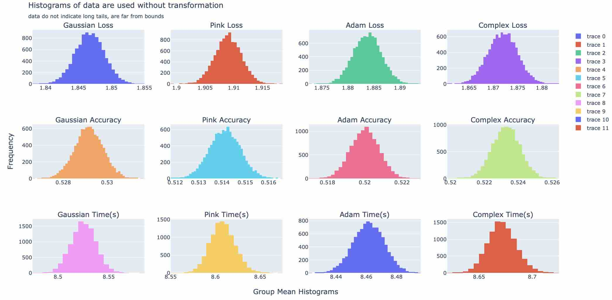
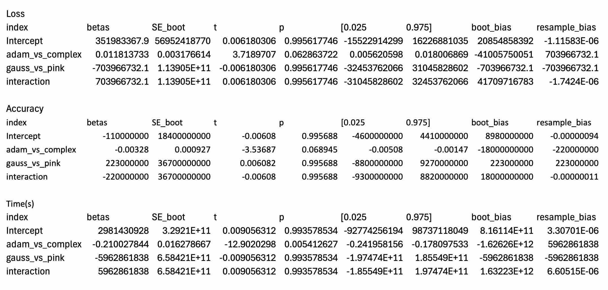

# Preliminary Performance Comparison between Gaussian vs. Pink Initializers and ComplexAdam and Adam Optimizers for Transformer Neural Networks

Gaussian initialization of transformer neural networks seems commonplace, yet there are other initialization values that can be used. Models may have less distance to cover from initialized values to functional weights with different initializers. Optimizers such as Adam are also commonplace and there seems to always be interest in possible improvements. Pink noise initialization was hypothesized to result in improved loss, accuracy and time over gaussian initialization. Complex Adam, which results in weights with magnitude and phase information was hypothesized to improve loss, accuracy and time. Results indicate surprising differences for each comparison, with gaussian initialization outperforming pink initialization for loss, accuracy and time; and complex adam outperforming adam for loss and accuracy, but not time for transformer neural networks trained on a python corpus. Future work on comparing transformer neural network architectures using different initializers and optimizers on benchmark tasks raises interesting questions that may impact architecture choice.

## Methods

For 4 different variables, 1000 Small local transformer neural networks were separately trained on an M2 with 24 Gb unified RAM using a python corpus with two initialization and optimization architecture choices in a fully factorial 2x2 design using a resampling technique. Samples of 600 of the 1000 trials each of 4 groups were resampled 10,000 times. Evaluation included loss, next token accuracy and time. A normal approximation was assumed (no transformations) as reviewing histogram shapes which seemed to indicate the data are far enough from possible bounds. 

### Models

Histograms of the bootstrapped group distributiosn for each dependent variable were created. Their shape lent to fitting a model without transformation. Means of means across samples were calculated with bootstrapped confidence intervals. A statistical model is fit to the trial metrics for loss, accuracy and time(s). Sum to zero orthogonal contrasts were created to result in the parameter estimates being the mean difference between adam vs complex adam optimizers and gaussian vs pink noise weight initialization. A third code, for the interaction term, was included to ensure a full set of codes was used for the full factorial design. The interaction term was not interpreted as AdamVsComplex and GaussVsPink change direction and there was no hypothesis for the comparison. No post-hoc analyses were performed as the models coded the effects of interest directly.

$$ loss, acc, secs = AdamVsComplex + GaussVsPink + C(AdamVsComplex * GaussVsPink) $$
## Bias

Bias and resampling bias are presented as part of the results summaries.

$$ bias_{boot} = \beta_{boot} - \beta_{orig} $$

$$ bias_{resample} = mean(\beta_{boot} - \beta_{sample}) $$

## Results

Results are related each to loss, accuracy and time(s) analysis models presented in the figures and tables in the appendix. Initialization differences indicate gaussian initialization has lower loss, higher accuracy and is faster than pink-noise initialization, opposite to hypothesized outcomes. This may be explained in part that in non-published investigations into weight spectra for a different type of transformer NN, weights didn't resemble pink-noise due to adam optimization. The complex adam optimizer has lower loss, higher accuracy but took longer than adam by 0.2+ seconds, which, except for time, aligned with expectations. These findings may be expalinable in that comlex weight have phase and magnitude information instead of magnitude. 

## Limitations

No bootstrapped ANOVA table was included in this analysis.

## Appendix

